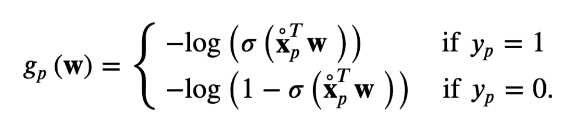
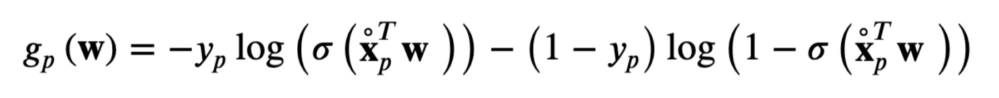

# Study Guide COSC 74 Midterm

## Practice Problems

A student is training a regression model to fit some data. We don’t know what she is doing with
her model, just that it is a regression model. After training, she notices that the test loss is very
high. Then the student checks the training loss.

1. If the training loss is very low, what would you suggest the student to do?

It appears that the student has over-fit their model - since there is very low loss on the training data, but very high loss on the test data. To counter an over-fit model, we can simplify our model, i.e. use a linear model instead of a quadratic model.

1. If the training loss is also very high, what would you suggest the student to do?

Since the training loss and the test loss are very high, it appears that we might have underfit our data, we should try and make our model a bit more complex, possibly fitting a quadratic model over a linear model.

1. What are the differences and similarities between a step function and a sigmoid function?

Difference: A step function is not differentiable, because at the step the deriv. is undefined, while a sigmoid makes a smooth transition from the bottom half to the top half
Similar: They are similar in that they are bounded between two finite values.

1. What are the differences and similarities between linear regression and linear classification?

Difference: Regression gives a scalar output that is not necessarily bounded, whereas a classification determines which output from a set of predetermined outputs the input should correspond to. More simply put, a regression learns a line of best fit to some data, and a classification separates the data with a line, outputting a binary score.

regression predicts continuous outputs, classification predicts discrete outputs.

Similar: They both assume that data exhibits linear tendencies, i.e. the data is linearly separable, or it is linearly set.

1. Which regularizer (L1 or L2) is better for feature selection? Why?

L1 is better for feature selection, because it will effectively remove features from your model by setting their weights to 0, therefore highlighting the dominant features.

### Which of the following functions are convex:

- $y=x^2−4$

  This is convex

- $y=x^3−8$

  This is not convex

1. What is the purpose of a cost function?

The purpose of a cost function is to determine how poor your model performs against your training data. i.e. given the inputs (data, model, weights for model), how much does it "cost" to use this model with these weights on your data. The goal is to minimize the cost, or the error of your model on your data.

1. What can cause erratic behavior of your cost when running gradient descent?

An alpha, or learning rate that is too large will cause you to overlearn in a given direction, and cause large fluctuation - or erratic behavior.

1. Given the following confusion matrix, please calculate the true positive rate, false positive rate, and the F1 score.

| -        | Predicted 0 | Predicted 1 |
| -------- | ----------- | ----------- |
| Actual 0 | 900         | 900         |
| Actual 1 | 100         | 100         |

TPR = TP / (TP + FN) = 100 / 200 = 1/2

FPR = FP / (FP + TN) = 900 / (1800) = 1/2

precision = TP / (TP + FP) = 100 / 1000 = 1/10

recall = TP / (TP + FN) = TPR = 1/2

F1 = 2\*(precision \* recall) / (precision + recall) = 1/6

1. After running gradient descent and getting back a list of weights and costs, which weights correspond to the “learned” weights of your model?

The lasts ones

1. When is gradient descent guaranteed to find the global minimum?

If your convex is convex, but this is not the only trait - we can generalize to say that if there is only one local min, and that is also the global min, then we are guaranteed to find the global min too.

1. How would you modify an L2 regularizer so that certain weights are regularized more than others?

???

1. Can the cost of a model ever be less than 0?

Of course! We did one in the HW1 that has a minimum of less than 0.

## Notes

# Lecture 1

- Supervised Learning

  - When you have data that is labeled

- Unsupervised Learning

  - When your data is not labeled

- Reinforced Learning

  - When the model learns from a series of successes and failures, and collects its own data.

# Lecture 2

- **Dataset** is your data.

  - YOu want your data to be large
  - Diverse
  - And Representative

- A **model** takes inputs and returns some output

- Features are the things that differentiate things in your data. The process of determining good features to learn on is called **feature engineering**

- Each feature then becomes a dimension in your **feature space**

- **parameters** are the weights of the model.

- **regression** vs. **classification**.

  - Regression fits continuous outputs, classification creates discrete outputs (called classes)

# Lecture 3

- We learn the **parameters** of a model through numerical optimization.

- To perform this optimization, we need to actually optimize some value - we use a **cost function** to determine what value we are actually optimizing (minimizing)

- Cost functions take in model parameters, and return a score indicating how well the learning task would be accomplished using those weights.

- Therefore, goal is to find the parameters that minimize the cost function.

- **Gradient Descent** is a method we can use to minimize functions that do not have closed-form solutions.

  - $w^k = w^{k-1} - \alpha \delta g(w^{k-1})$

# Lecture 4

- $\alpha$ is called the **learning-rate** or the **step-length** and is a **hyperparameter**

- a **hyperparameter** is a parameter that is NOT learned, but rather tunned by the scientist.

> Note: **Parameter** = Weights
>
> Note: **hyperparameter** = Constants

- Fixed/adjustable learning rate. One example is a **diminishing** learning rate, which gives $\alpha = 1/r$ where $r$ is the current iteration.

- A small learning rate and a large number of iterations will guarantee convergence to a local min, but will take a lot of time. A large learning rate with a small number of iterations will be ineffective.

- we tune the learning rate to reach **optimal learning**

# Lecture 5

- Least Squared Regression Cost Function, computes the average euclidean distance from each point to the learned hyperplane.

- **cost functions** must be differentiable.

- The formula for least squared cost function for each point:
  $$g_p(w) = (\dot{\vec{x}}^T_p\vec{w} - y_p)^2$$

  For the total:

  $$g(\vec{w}) = \frac{1}{P}\sum_{p=1}^P g_p(\vec{w})$$

- Note that the cost function $g(w)$ is more accurately written $g(\vec{x}, \vec{y}, \vec{w})$, because the cost function depends on the x and y values.

- Design Choices

  1. How do we parameterize the function? This corresponds to picking the **model**
  2. What learning objective do we use? This corresponds to picking the **cost function**
  3. How do we optimize the objective? This corresponds to picking the **learning algorithm** i.e. Gradient descent.

- **batch gradient descent** is another algorithm with samples data at each iteration, rather than iterating over the entire training set. Also called **stochastic** or **incremental** gradient descent

* Least squared is not robust to **outliers** because it squares errors, so larger errors are considered more important.

- An alternative is the **least absolute deviation function**.

  $$g_p(w) = |\dot{\vec{x}}^T_p\vec{w} - y_p|$$

  It is convex, but not smooth.

- **weighted regression** adds a weight to data points, adding a $\beta$ term to each term in the summation.

$$g_p(w) = \beta_p|\dot{\vec{x}}^T_p\vec{w} - y_p|$$

- where $\beta_p$ are pointwise weights associated with each input. This can be used to indicate how much we TRUST data points.

- We can also use the $\beta_p$ to indicate duplicates in a data set, so we don't need to loop over all duplicates.

# Lecture 6

- Mean Squared Error (**MSE**): Using the learned weights, we can recalculate the squared error which is really the remaining cost, given the test data.

- Mean Absolute Deviation (**MAD**): Using the learned weights, we can recalcualte the mean absolute deviation, which again is really recalculating the cost, given the test data.

- We can use MSE on a data set that we learned with using Least Absolute deviation, and vise versa.

- We make these calculations on the TEST data.

- Feature Transformation can be used to move into a different feature space, usually something that will allow us to separate our data using a linear regression.

- The idea with feature transformation is - make our data a bit more complex, maybe even increase the dimension of our feature space, but keep a simple model.

- **underfitting** when the model is too simple for the data.

- **overfitting** occurs when the model is too complex for the data.

# Lecture 7

- You can avoid overfitting by reducing the number of parameters you have, or by constraining their magnitude.

- **Regularization** is a process of introducing more information to avoid overfitting

- Add another term to the cost function:

$$g(\vec{w}) = \frac{1}{P}\sum_{p=1}^{P}(model(vec{x_p}, \vec{w})^2 + \lambda||\vec{w}||^2_2)$$

- Here you see we add a hyperparameter $\lambda$ which we call the smoothness parameter.

- And the squared L2 Norm. Together we call these a smoothness/complexity term.

- The larger we make $\lambda$ the smaller we will force the weights to be.

- The idea is that the more complex the model (larger weights) the larger the complexity term, and therefore the larger the cost. So we are penalizing more complex parameters.

- A regression model that uses L2 regularization is called **Ridge** Regression.

- A regression model that uses L1 regularization is called **Lasso** Regression.

- Ridge Regression will set irrelevant features to low weights, but not eliminate them.

- Lasso Regression is more likely to set irrelevant features to 0 weights. Lasso Regression is biased towards providing sparse solutions in general. L1 is more computationally expensive for large inputs. - because L1 is not smooth.

- L1 is more likely to ignore outliers (set irrelevant weights to 0) in the same way that absolute deviation ignores outliers - because each term contributes linearly, not quadratically.

- Elastic net regularization - combining L1 and L2.

- Can also add a fairness term...

- **Validation** is performed on a DIFFERENT set of data. Make sure when you first get data to split it into multiple (disjoint) sets: Training, and Testing. The Training set is further subdivided into a Training and Validation set.

- training and validation sets are used to learn a model, and the testing set is used to report the performance of the model

- training is used to learn the model; validation is used for hyperparameter tuning &| model selection.

- 70% training, 10% validation, 20% test - this is the standard

- **cross-validation** the process of splitting data into these components multiple times, performing the learning, validation, and testing processes, and then averaging the results.

- **Leave-one-out Cross-Validation** ?????

- **K-fold Cross-Validation** Split your 80% training set into blocks that are each 10% in size, run cross-validation for each one being the validation set.

# Lecture 8

- Hyperparameter tuning - We must have a search space, and some metric to work off.

- We can use **grid-search**, i.e. brute forcing through hyperparameter options.

- Another option is **random-search**, randomly searching through hyperparameter options.

- Another option is **SKLEARN** - this is a python package that offers hyperparameter tuning.

### Classification

- Outputs are in the form of classes.

- **binary classifiers** classify data into 1 of two classes, i.e. true or false

- Examples of binary classifiers include logistic regression, perceptron, and support vector machines.

- Points are separated by a series of "steps", when N=1, it is a point, and consequently in dimension=K it is a dimension K-1 hyperplane. It separation point does not NEED to be linear though - it is possible that it is not, we will need to change our cost/activation functions then.

- We cannot use a step function is because it is not continuous, so we use the sigmoid function

$$\sigma(x) = \frac{1}{1 +e^{-x}}$$

- This is also called a **logistic** function

- But this function is not convex, so rather than changing our algorithm for gradient descent, we can approximate this function with a convex function:

- Here comes the **Log Error** Functions

- This is called a **cross-entropy** cost function.

# Lecture 9

- **Logistic Regression** is a linear binary classifier.

- We then use an **activation function** to differentiable between binary classes based on the logistic function.

- A **percepton** learns the decision boundary directly.

- We are splitting the space into two halves, a top half and a bottom half using a hyperplane.

- If the class if positive, we want the model to output a value greater than 0, if negative we want the model to output a value less than 0. Therefore, we can simplify, since we are using a linear model to the following:

$$-y_p\vec{\dot{x}}_p^T\vec{w} < 0$$

- Therefore, a good cost function is:
  $$g_p(\vec{w}) = max(0, -y_p\vec{\dot{x}}_p^T\vec{w})$$

- But this cost function isn't smooth, but we can use the softmax function to approximate it:

$$soft(a,b) = ln(e^a + e^b)$$

- We use the `sign` function to tell us what side of the hyperplane our data is on.

- `sign` is another form of an activation function.

> Logistic Regression learns the decision boundary through nonlinear regression
>
> Perceptron learns the decision boundary directly

# Lecture 10

### Classification Quality Metrics

- The confusion matrix has entries which correspond to predicted values and true values.

| -   | P+  | P-  |
| --- | --- | --- |
| R+  | A   | B   |
| R-  | C   | D   |

- Accuracy Metric:

$$\mathcal{A} = \frac{A+D}{A+B+C+D}$$

$$\mathcal{A}+ = \frac{A}{A+C}$$
$$\mathcal{A}_ = \frac{D}{D+B}$$

$$\mathcal{A}_b = \frac{1}{2}\frac{A}{A+C} + \frac{1}{2}\frac{D}{D+B}$$

$$FPR = \frac{FP}{FP + TN}$$
$$TPR = \frac{TP}{TP + FN}$$

Recall = TPR

Precision = $$\frac{TP}{TP + FP}$$

F1 = 2\*(precision \* recall) / (precision + recall)

- **AUC** is the Area under the curve. We want this to be as high as possible for ROC

- AUC of 0.5 corresponds to a model that guesses, anything that is within a small bit of that is bad - but being far to one side doesn't necessarily mean you have a bad model, b/c you can simply switch your activation function.

- **ROC** curve is the Receiver Operating Characteristic curve. It is a graphical plot that illustrates the diagnostic ability of a binary classifier system as its discrimination threshold is varied.

- Basic concept is, if the threshold is 0, we output nothing as positive, so we have a 0 false positive rate, but we also have a 0 true positive rate, but if we set the threshold to 1, we output EVERYTHING as positive, so we have a 100% false positive rate (i.e. since we have 0 true negatives), but we also have a 100% true positive rate, since everything that IS positive, we output as positive.,
